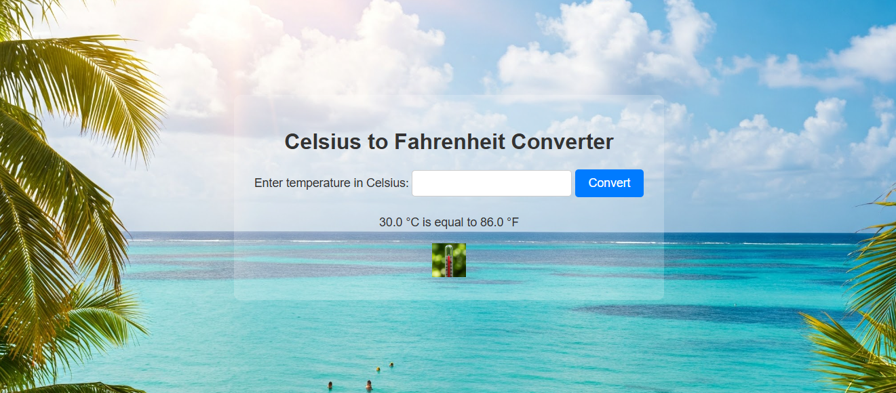

### Test driving Gemini to develop a simple webapp

The app converts temperature from Celsius to Fahrenheit and demos the following
1. Using Javascript to show different background image based on the temperature.
2. Flask to send a query and get a response from a data entered via a webpage.
3. Using pytest to check python code.
4. Using setuptools/pyproject.toml for building a package that can be installed using pip.
5. Next steps - deploy it on cloud and monitor for any issues and expenses

[]